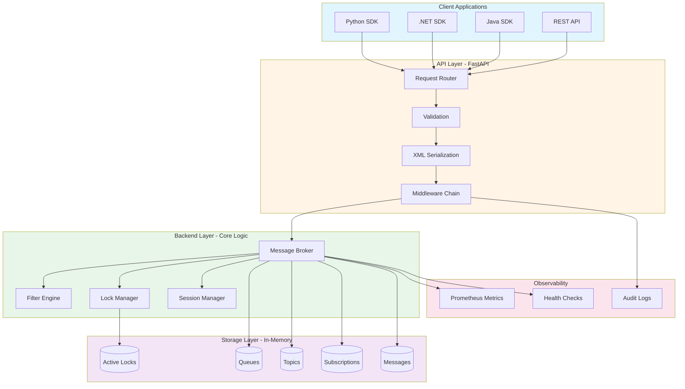
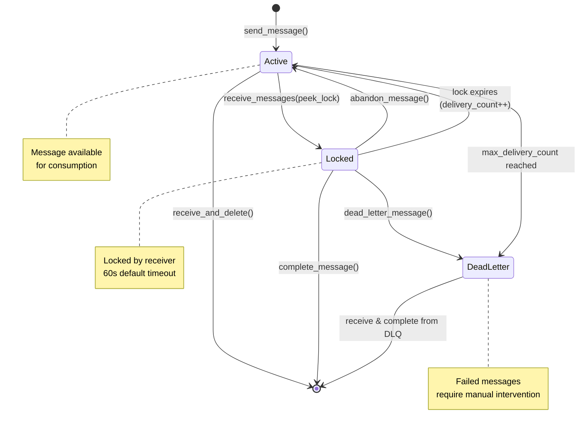
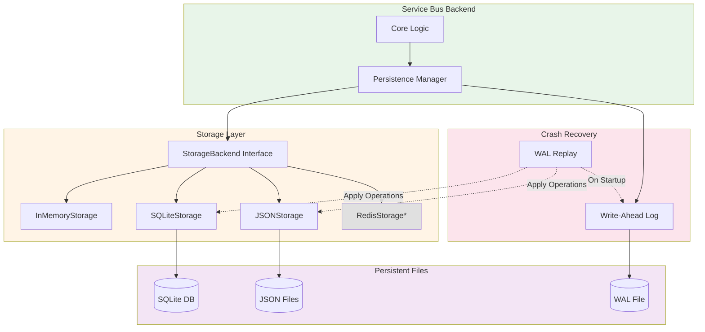
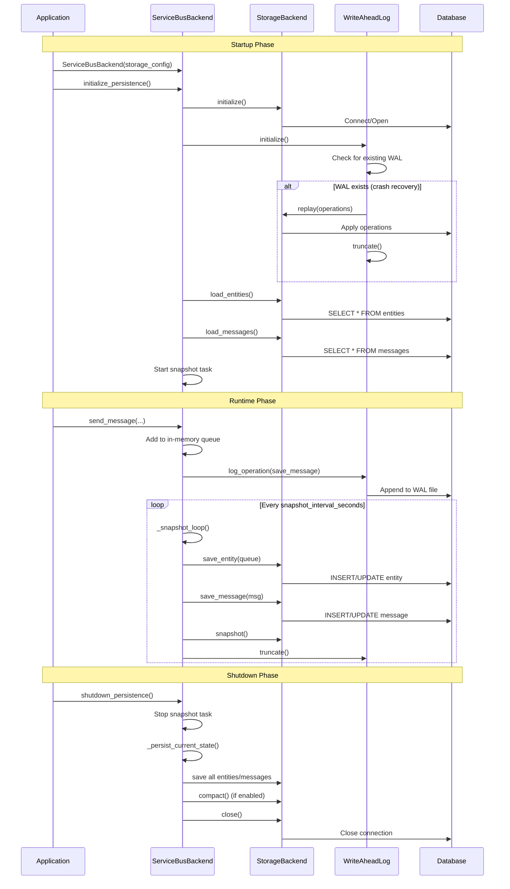
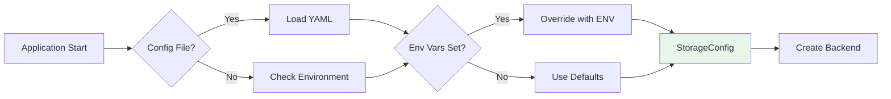

# Service Bus Architecture

Technical architecture and design decisions for LocalZure Service Bus emulator.

## System Overview



## Component Architecture

### API Layer (api.py)

FastAPI-based REST API implementing Azure Service Bus protocol.

**Responsibilities:**
- HTTP request routing
- Request validation
- Azure Service Bus REST API compatibility
- Response formatting (Atom XML)
- Error handling

**Key Endpoints:**

```
Queues:
  PUT    /servicebus/queues/{name}                  # Create queue
  GET    /servicebus/queues                          # List queues
  GET    /servicebus/queues/{name}                   # Get queue
  DELETE /servicebus/queues/{name}                   # Delete queue
  POST   /servicebus/queues/{name}/messages          # Send message
  POST   /servicebus/queues/{name}/messages/head     # Receive message

Topics:
  PUT    /servicebus/topics/{name}                   # Create topic
  GET    /servicebus/topics                          # List topics
  POST   /servicebus/topics/{name}/messages          # Publish message

Subscriptions:
  PUT    /servicebus/topics/{name}/subscriptions/{sub}         # Create subscription
  GET    /servicebus/topics/{name}/subscriptions                # List subscriptions
  POST   /servicebus/topics/{name}/subscriptions/{sub}/messages/head  # Receive message

Rules (Filters):
  PUT    /servicebus/topics/{name}/subscriptions/{sub}/rules/{rule}  # Create rule
  GET    /servicebus/topics/{name}/subscriptions/{sub}/rules          # List rules
  DELETE /servicebus/topics/{name}/subscriptions/{sub}/rules/{rule}  # Delete rule

Management:
  GET    /servicebus/health               # Health check
  GET    /servicebus/health/ready         # Readiness probe
  GET    /servicebus/health/live          # Liveness probe
  GET    /servicebus/metrics              # Prometheus metrics
  GET    /servicebus/docs                 # OpenAPI docs
```

**Design Decisions:**

1. **FastAPI Framework**
   - Automatic OpenAPI documentation
   - Pydantic validation
   - Async support
   - Type hints

2. **Atom XML Format**
   - Azure Service Bus standard
   - XML serialization/deserialization
   - Namespace handling

3. **Middleware Chain**
   - Request logging (before/after)
   - Correlation ID tracking
   - Authentication validation (stub)
   - Error handling

### Backend Layer (backend.py)

Core message broker logic.

**Responsibilities:**
- Queue/topic/subscription lifecycle
- Message storage and retrieval
- Lock management
- Filter evaluation
- Dead-letter handling
- Session management

**Data Structures:**

```python
class ServiceBusBackend:
    _queues: Dict[str, Queue]           # queue_name -> Queue
    _topics: Dict[str, Topic]           # topic_name -> Topic
    _subscriptions: Dict[str, Dict[str, Subscription]]  # topic -> sub -> Subscription
    _queue_messages: Dict[str, List[Message]]           # queue_name -> messages
    _subscription_messages: Dict[str, List[Message]]    # sub_path -> messages
    _active_locks: Dict[str, MessageLock]               # lock_token -> lock
    _scheduled_messages: List[ScheduledMessage]         # scheduled messages
    _lock: asyncio.Lock                                 # concurrency control
```

**Message Lifecycle:**



**Concurrency Model:**

```python
# All backend operations protected by asyncio.Lock
async with self._lock:
    # Critical section
    # - Read/write queues
    # - Read/write messages
    # - Update locks
    pass

# Benefits:
# - Thread-safe operations
# - No race conditions
# - Consistent state

# Trade-offs:
# - Serial execution
# - Limited throughput
# - Good for emulator, not production
```

**Design Decisions:**

1. **In-Memory Storage**
   - Fast (< 1ms latency)
   - No persistence
   - Simple implementation
   - Trade-off: data loss on restart

2. **Single Lock**
   - Simplifies concurrency
   - Prevents race conditions
   - Trade-off: serial execution
   - Alternative: fine-grained locks per queue

3. **Background Tasks**
   - Lock expiration cleanup (every 10s)
   - Scheduled message delivery (every 5s)
   - Metrics collection (every 60s)

### Filter Engine (filters.py)

**SQL Filter Architecture:**

```mermaid
graph TD
    A[SQL Expression String] --> B[Tokenizer]
    B --> C[Token Stream]
    C --> D[Parser]
    D --> E[Abstract Syntax Tree]
    E --> F[Evaluator]
    F --> G{Match?}
    G -->|True| H[Add to Subscription]
    G -->|False| I[Skip Message]
    
    B -.->|Example| J["'priority', '=', 'high'"]
    D -.->|Example| K["BinaryOp(=, 'priority', 'high')"]
    F -.->|Context| L[Message Properties]
    
    style A fill:#e1f5ff
    style C fill:#fff4e6
    style E fill:#e8f5e9
    style G fill:#fff3e0
    style H fill:#c8e6c9
    style I fill:#ffcdd2
``` ▼
True/False
```

**Supported Operators:**

```python
COMPARISON = ['=', '!=', '<', '>', '<=', '>=']
LOGICAL = ['AND', 'OR', 'NOT']
SET = ['IN', 'NOT IN']
PATTERN = ['LIKE', 'NOT LIKE']
NULL = ['IS NULL', 'IS NOT NULL']
```
**Filter Evaluation Flow:**

```mermaid
flowchart TD
    A[Message Published to Topic] --> B{For Each Subscription}
    B --> C{For Each Rule}
    C --> D{Filter Type?}
    
    D -->|SQL Filter| E[Parse SQL Expression]
    E --> F[Evaluate Against Properties]
    F --> G{Match?}
    
    D -->|Correlation Filter| H[Match Properties]
    H --> G
    
    D -->|True Filter| I[Always Match]
    I --> J[Add to Subscription Queue]
    
    G -->|Yes| J
    G -->|No| K[Try Next Rule]
    K --> C
    
    C -->|No More Rules| L[Skip Subscription]
    B -->|More Subs| C
    B -->|Done| M[Deliver to All Matched]
    
    style A fill:#e1f5ff
    style D fill:#fff4e6
    style G fill:#fff3e0
    style J fill:#c8e6c9
    style L fill:#ffcdd2
```ch All
```

**Performance Characteristics:**

| Filter Type | Parse Time | Eval Time | Use Case |
|-------------|------------|-----------|----------|
| TrueFilter | 0ms | 0ms | Default (all messages) |
| Correlation | 0ms | < 0.01ms | Exact property match |
| Simple SQL | ~1ms | < 0.1ms | 1-2 conditions |
| Complex SQL | ~5ms | < 1ms | 3+ conditions, patterns |

**Design Decisions:**

1. **Custom SQL Parser**
   - Subset of SQL-92
   - No external dependencies
   - Optimized for message properties
   - Trade-off: limited SQL feature set

2. **Early Exit**
   - Stop at first matching rule
   - Performance optimization
   - Trade-off: rule order matters

3. **Property Type Coercion**
   - Automatic string↔number conversion
   - Flexible comparisons
   - Trade-off: potential unexpected behavior

### Storage Layer

**Overview:**

LocalZure Service Bus supports optional persistent storage (SVC-SB-010) with pluggable backends.

**Storage Architecture:**



*Note: RedisStorage is a placeholder for future implementation*

**Storage Backends:**

| Backend | Use Case | Persistence | ACID | Performance | Dependencies |
|---------|----------|-------------|------|-------------|--------------|
| **In-Memory** | Development, Testing | ❌ No | N/A | ⚡ Fastest (baseline) | None |
| **SQLite** | Production, Single-node | ✅ Yes | ✅ Yes | ~5-10% slower | aiosqlite |
| **JSON** | Development, Debugging | ✅ Yes | ❌ No | ~15-25% slower | None |
| **Redis** | Distributed (future) | ✅ Yes | ⚠️ Partial | TBD | redis-py |

**Persistence Lifecycle:**



**In-Memory Storage (Default):**

Default behavior using Python dictionaries and lists.

**Schema:**

```python
# Queues
_queues = {
    "orders": Queue(
        name="orders",
        max_delivery_count=10,
        lock_duration_seconds=60,
        default_message_time_to_live_seconds=1209600,
        max_size_in_megabytes=1024,
        requires_session=False
    )
}

# Messages
_queue_messages = {
    "orders": [
        Message(
            message_id="msg-001",
            content_type="application/json",
            label="new-order",
            body="order data",
            properties={"priority": "high"},
            enqueued_time_utc=datetime.utcnow(),
            sequence_number=1,
            delivery_count=0,
            locked_until_utc=None,
            lock_token=None
        )
    ]
}

# Topics
_topics = {
    "events": Topic(name="events")
}

# Subscriptions
_subscriptions = {
    "events": {
        "high-priority": Subscription(
            name="high-priority",
            topic_name="events",
            rules=[
                Rule(
                    name="priority-filter",
                    sql_filter="priority = 'high'"
                )
            ]
        )
    }
}

# Locks
_active_locks = {
    "lock-token-123": MessageLock(
        message_id="msg-001",
        queue_name="orders",
        locked_until=datetime.utcnow() + timedelta(seconds=60)
    )
}
```

**SQLite Persistent Storage:**

When persistence is enabled, data is stored in SQLite with the following schema:

```sql
-- Entity storage (queues, topics, subscriptions)
CREATE TABLE entities (
    entity_type TEXT NOT NULL,       -- 'queue', 'topic', 'subscription'
    entity_name TEXT NOT NULL,       -- Entity identifier
    data JSON NOT NULL,              -- Serialized entity properties
    created_at TIMESTAMP DEFAULT CURRENT_TIMESTAMP,
    updated_at TIMESTAMP DEFAULT CURRENT_TIMESTAMP,
    PRIMARY KEY (entity_type, entity_name)
);

-- Message storage
CREATE TABLE messages (
    entity_name TEXT NOT NULL,       -- Queue name or subscription path
    message_id TEXT NOT NULL,        -- Unique message identifier
    data JSON NOT NULL,              -- Serialized message
    state TEXT NOT NULL DEFAULT 'active',  -- 'active', 'deadletter'
    enqueued_at TIMESTAMP NOT NULL DEFAULT CURRENT_TIMESTAMP,
    expires_at TIMESTAMP,            -- TTL expiration
    PRIMARY KEY (entity_name, message_id)
);

-- Application state (sequence counters, etc.)
CREATE TABLE state (
    key TEXT PRIMARY KEY,
    value JSON NOT NULL,
    updated_at TIMESTAMP DEFAULT CURRENT_TIMESTAMP
);

-- Schema versioning for migrations
CREATE TABLE schema_version (
    version INTEGER PRIMARY KEY,
    applied_at TIMESTAMP DEFAULT CURRENT_TIMESTAMP
);

-- Performance indexes
CREATE INDEX idx_messages_state ON messages(state);
CREATE INDEX idx_messages_expires ON messages(expires_at);
CREATE INDEX idx_entities_type ON entities(entity_type);
```

**SQLite Configuration:**

```sql
-- Write-Ahead Logging for crash safety
PRAGMA journal_mode=WAL;

-- Performance tuning
PRAGMA synchronous=NORMAL;      -- Balance between safety and speed
PRAGMA cache_size=16000;         -- 64MB cache
PRAGMA temp_store=MEMORY;        -- Temp tables in memory
PRAGMA mmap_size=268435456;      -- 256MB memory-mapped I/O
```

**JSON File Storage:**

Alternative human-readable storage format:

```
data/
  entities/
    queues.json           # All queue definitions
    topics.json           # All topic definitions  
    subscriptions.json    # All subscription definitions
  messages/
    queue_orders.json     # Messages for 'orders' queue
    queue_payments.json   # Messages for 'payments' queue
    subscription_events_high-priority.json  # Subscription messages
  state.json              # Sequence counters and internal state
```

**Write-Ahead Log (WAL):**

Crash recovery mechanism that logs all operations before they're applied:

```
Format: JSON Lines (one operation per line)

Example WAL entries:
{"op": "save_entity", "entity_type": "queue", "entity_name": "orders", "data": {...}, "ts": "2025-12-11T10:15:23Z"}
{"op": "save_message", "entity_name": "orders", "message_id": "msg-001", "data": {...}, "state": "active", "ts": "2025-12-11T10:15:24Z"}
{"op": "delete_message", "entity_name": "orders", "message_id": "msg-001", "ts": "2025-12-11T10:15:25Z"}
{"op": "save_state", "key": "sequence_counters", "value": {"orders": 42}, "ts": "2025-12-11T10:15:26Z"}

Recovery process:
1. On startup, check for existing WAL file
2. If found, load last snapshot from storage
3. Replay all WAL operations in sequence
4. Truncate WAL after successful replay
5. Resume normal operation

WAL is truncated after each snapshot to prevent unbounded growth.
```

**Configuration Loading:**



Priority: Environment Variables > YAML Config > Defaults

**Queue Send/Receive:**

```mermaid
sequenceDiagram
    participant Client
    participant API as REST API
    participant Backend
    participant Storage
    
    Note over Client,Storage: Send Message
    Client->>+API: POST /queues/orders/messages
    API->>+Backend: send_message(queue, msg)
    Backend->>+Storage: append(message)
    Storage-->>-Backend: OK
    Backend-->>-API: 201 Created
    API-->>-Client: 201 Created
    
    Note over Client,Storage: Receive Message (Peek-Lock)
    Client->>+API: POST /queues/orders/messages/head
    API->>+Backend: receive_messages(queue, 1)
    Backend->>+Storage: peek_message()
    Storage-->>-Backend: message
    Backend->>Backend: create_lock(message, 60s)
    Backend-->>-API: locked_message
    API-->>-Client: 200 OK + BrokerProperties
    
**Topic Publish/Subscribe:**

```mermaid
sequenceDiagram
    participant Publisher
    participant API
    participant Backend
    participant FilterEngine as Filter Engine
    participant Storage
    
    Note over Publisher,Storage: Publish to Topic
    Publisher->>+API: POST /topics/events/messages
    API->>+Backend: publish_message(topic, msg)
    Backend->>+FilterEngine: evaluate_all_subscriptions()
    
    loop For Each Subscription
        FilterEngine->>FilterEngine: eval_rules(msg.properties)
        alt Match Found
            FilterEngine->>Storage: append(subscription, msg)
        end
    end
    
    FilterEngine-->>-Backend: matched_subs
    Backend-->>-API: 201 Created
    API-->>-Publisher: 201 Created
    
    Note over Publisher,Storage: Subscribe and Receive
    participant Subscriber
    Subscriber->>+API: POST /subs/high-priority/messages/head
    API->>+Backend: receive_from_subscription()
**Session Architecture:**

```mermaid
graph TD
    Q[Session-Enabled Queue: orders]
    
    Q --> S1[Session: user-123]
    Q --> S2[Session: user-456]
    Q --> S3[Session: user-789]
    
    S1 --> M1[Message seq=1<br/>Order 1001]
    S1 --> M2[Message seq=2<br/>Order 1002]
    S1 --> M3[Message seq=3<br/>Order 1003]
    
    S2 --> M4[Message seq=4<br/>Order 2001]
    S2 --> M5[Message seq=5<br/>Order 2002]
    
    S3 --> M6[Message seq=6<br/>Order 3001]
    
    L1[Lock: user-123<br/>expires: 10:35:00]
    L1 -.->|Locked| S1
    
    style Q fill:#e1f5ff
    style S1 fill:#fff9c4
    style S2 fill:#e8f5e9
    style S3 fill:#e8f5e9
    style L1 fill:#ffcdd2
```                    │                    │◀──────────────────│
  │◀───────────────────│◀──────────────────│                    │
**Session Workflow:**

```mermaid
sequenceDiagram
    participant Client
    participant Backend
    participant SessionMgr as Session Manager
    participant Storage
    
    Note over Client,Storage: Accept Session
    Client->>+Backend: accept_session("user-123")
    Backend->>+SessionMgr: acquire_lock("user-123")
    SessionMgr->>SessionMgr: create_session_lock(60s)
    SessionMgr-->>-Backend: lock_token
    Backend-->>-Client: session_receiver + lock_token
    
    Note over Client,Storage: Receive Messages (FIFO)
    Client->>+Backend: receive_messages(session_lock)
    Backend->>+Storage: get_messages(session="user-123", ordered=true)
    Storage-->>-Backend: [msg1(seq=1), msg2(seq=2)]
    Backend-->>-Client: ordered_messages
    
    Note over Client,Storage: Manage Session State
    Client->>+Backend: set_session_state(lock, data)
    Backend->>+SessionMgr: update_state("user-123", data)
    SessionMgr-->>-Backend: OK
    Backend-->>-Client: OK
    
    Note over Client,Storage: Release Session
    Client->>+Backend: close_session(lock)
    Backend->>+SessionMgr: release_lock("user-123")
    SessionMgr->>SessionMgr: make_available()
    SessionMgr-->>-Backend: OK
    Backend-->>-Client: OK
``` │
    └─ Session "user-789"
        └─ Message 1 (seq=6)
```

**Session Lock:**

```python
class SessionLock:
    session_id: str
    queue_name: str
    locked_until: datetime
    lock_token: str
    session_state: Optional[bytes]  # Application-defined state
```

**Session Workflow:**

```
1. Accept Session
   Client → accept_session("user-123")
   Backend → Lock session "user-123"
   Backend → Return lock token

2. Receive Messages (in order)
   Client → receive_messages(session_lock)
   Backend → Return messages with seq=1,2,3...

3. Update Session State
   Client → set_session_state(session_lock, state_data)
   Backend → Store state for session

4. Release Session
   Client → close_session(session_lock)
   Backend → Release lock, make available to other clients
```

**Design Decisions:**

1. **Ordered Delivery**
   - Messages delivered in sequence number order
   - Guarantees FIFO per session
   - Trade-off: lower throughput per session

2. **Session State**
   - Opaque byte array (up to 256 KB)
   - Application-defined semantics
   - Persistent across lock renewals

3. **Exclusive Lock**
   - One client per session at a time
   - Prevents concurrent processing
   - Trade-off: requires session management

### Dead-Letter Queue

DLQ for messages that fail processing.

**DLQ Triggers:**

1. **Automatic:**
   - Max delivery count exceeded
**Metrics Architecture:**

```mermaid
graph TB
    subgraph "Application"
        OPS[Backend Operations]
        DEC[@track_metric Decorator]
        OPS --> DEC
    end
    
    subgraph "Prometheus Client"
        COUNTER[Counter<br/>messages_sent_total<br/>errors_total]
        GAUGE[Gauge<br/>active_messages<br/>active_locks]
        HIST[Histogram<br/>send_duration_seconds<br/>receive_duration_seconds]
        
        DEC --> COUNTER
        DEC --> GAUGE
        DEC --> HIST
    end
    
    subgraph "Background Tasks"
        BG[Metrics Collector<br/>every 60s]
        BG --> GAUGE
    end
    
    subgraph "Export"
        ENDPOINT[/metrics Endpoint]
        COUNTER --> ENDPOINT
        GAUGE --> ENDPOINT
        HIST --> ENDPOINT
    end
    
    subgraph "Monitoring Stack"
        PROM[Prometheus Server<br/>Scrape every 30s]
        GRAF[Grafana Dashboard<br/>Visualize & Alert]
        
        ENDPOINT --> PROM
        PROM --> GRAF
    end
    
    style OPS fill:#e1f5ff
    style COUNTER fill:#c8e6c9
    style GAUGE fill:#fff9c4
    style HIST fill:#ffccbc
    style GRAF fill:#e1bee7
```ython SDK
dlq_receiver = client.get_queue_receiver(
    "orders",
    sub_queue=ServiceBusSubQueue.DEAD_LETTER
)

# REST API
POST /servicebus/queues/orders/$DeadLetterQueue/messages/head
```

### Monitoring & Metrics

Prometheus-based metrics collection.

**Metrics Architecture:**

```
Backend Operations
    │
    ▼
Metrics Decorator (@track_metric)
    │
    ▼
Prometheus Collectors
    │
    ├─ Counter (errors_total, messages_sent, ...)
    ├─ Gauge (active_messages, active_locks, ...)
    └─ Histogram (send_duration, receive_duration, ...)
    │
    ▼
Background Task (collect_metrics_task)
    │ (every 60s)
    ▼
Update Resource Gauges
    │
    ▼
Prometheus Scraper
    │ (GET /metrics)
    ▼
Prometheus Server → Grafana Dashboard
```

**Metrics Collected:**

```
# Counters
servicebus_messages_sent_total{entity_type, entity_name}
servicebus_messages_received_total{entity_type, entity_name}
servicebus_messages_completed_total{entity_type, entity_name}
servicebus_messages_abandoned_total{entity_type, entity_name}
servicebus_messages_deadlettered_total{entity_type, entity_name}
servicebus_errors_total{operation, error_type}

# Gauges
servicebus_active_messages{entity_type, entity_name}
servicebus_deadletter_messages{entity_type, entity_name}
servicebus_active_locks
servicebus_queues_count
servicebus_topics_count
servicebus_subscriptions_count

# Histograms
servicebus_send_duration_seconds{entity_type, entity_name}
servicebus_receive_duration_seconds{entity_type, entity_name}
servicebus_complete_duration_seconds{entity_type, entity_name}
servicebus_filter_evaluation_duration_seconds{topic_name}
```

**Health Checks:**

```python
# Liveness: Is service alive?
GET /health/live
→ 200 if process is running

# Readiness: Can service handle requests?
GET /health/ready
→ 200 if backend is healthy
→ 503 if backend has errors

# Overall health
GET /health
→ {
    "status": "healthy",
    "queues": 5,
    "topics": 3,
    "active_messages": 42
  }
```

## Design Patterns

### 1. Singleton Backend

```python
# Global instance
_backend = ServiceBusBackend()

def get_backend() -> ServiceBusBackend:
    return _backend

# Benefits:
# - Single source of truth
# - Shared state across requests
# - Simple dependency injection
```

### 2. Async Context Managers

```python
async with self._lock:
    # Critical section
    pass

# Benefits:
# - Automatic lock acquisition/release
# - Exception safety
# - Clean syntax
```

### 3. Dependency Injection

```python
@app.post("/queues/{queue_name}/messages")
async def send_message(
    queue_name: str,
    backend: ServiceBusBackend = Depends(get_backend)
):
    await backend.send_message(queue_name, message)

# Benefits:
# - Testable (mock backend)
# - Flexible (swap implementations)
# - Type-safe
```

### 4. Decorator Pattern

```python
@track_metric("send_message")
async def send_message(self, queue_name: str, message: Message):
    # Automatically tracked:
    # - Duration
    # - Success/error count
    # - Labels
    pass

# Benefits:
# - Separation of concerns
# - Reusable instrumentation
# - Clean business logic
```

## Performance Considerations

### Latency Targets

| Operation | P50 | P95 | P99 |
|-----------|-----|-----|-----|
| Send | < 0.5ms | < 1ms | < 5ms |
| Receive | < 1ms | < 2ms | < 10ms |
| Complete | < 0.5ms | < 1ms | < 5ms |
| SQL Filter | < 0.1ms | < 1ms | < 5ms |
| Correlation Filter | < 0.01ms | < 0.05ms | < 0.1ms |

### Throughput Targets

| Scenario | Target |
|----------|--------|
| Single queue send | 10,000 msg/s |
| Single queue receive | 10,000 msg/s |
| Topic fanout (10 subs) | 5,000 msg/s |
| Session queue | 5,000 msg/s |

### Scalability Limits

| Resource | Limit | Configurable |
|----------|-------|--------------|
| Max queues | 1,000 | Yes (MAX_ENTITY_COUNT) |
| Max topics | 1,000 | Yes |
| Max subscriptions/topic | 2,000 | Yes |
| Max messages/queue | 10,000 | Yes (MAX_QUEUE_SIZE) |
| Max message size | 256 KB | Yes |
| Max concurrent locks | 10,000 | No (memory-limited) |

## Security Architecture

### Authentication (Stub)

```python
def validate_auth(connection_string: str) -> bool:
    # Stub implementation
    # Always returns True
    # No SAS token validation
    return True

# Production would:
# - Parse SAS token
# - Validate signature
# - Check expiration
# - Verify permissions
```

### Authorization (Stub)

```python
def check_permission(entity: str, operation: str) -> bool:
    # Stub implementation
    # Always returns True
### SVC-SB-010: Persistence

```mermaid
graph LR
    subgraph "Current Architecture"
        A[Application] --> B[In-Memory Storage]
        B -.->|Data Lost| C[Restart]
    end
    
    subgraph "Future Architecture SVC-SB-010"
        D[Application] --> E[Storage Interface]
        E --> F[SQLite<br/>Development]
        E --> G[PostgreSQL<br/>Staging]
### SVC-SB-010: Duplicate Detection

```mermaid
flowchart TD
    A[Message with MessageId] --> B[Hash MessageId]
    B --> C{Check Bloom Filter}
    C -->|Not Seen| D[Store Hash]
    C -->|Seen| E[Reject as Duplicate]
    D --> F[Add to Dedup Window<br/>10 minutes]
    F --> G[Process Message]
    E --> H[Return Error to Client]
    
    I[Background Cleanup<br/>Every 60s] --> J[Remove Expired Hashes]
    J --> C
    
    style C fill:#fff3e0
    style G fill:#c8e6c9
    style H fill:#ffcdd2
    style F fill:#e1f5ff
``` validate_sql_filter(expression: str) -> bool:
    # Whitelist operators
    # No arbitrary code execution
    # Limited to property comparisons
### SVC-SB-010: Transactions

```mermaid
stateDiagram-v2
    [*] --> TransactionStarted: begin_transaction()
    
    TransactionStarted --> Accumulating: send(Queue A)
    Accumulating --> Accumulating: send(Queue B)
    Accumulating --> Accumulating: complete(Queue C)
    
    Accumulating --> Committing: commit()
    Accumulating --> RollingBack: rollback() or error
    
    Committing --> Applied: All operations succeed
    Committing --> RollingBack: Any operation fails
    
    RollingBack --> Reverted: All changes undone
    
    Applied --> [*]: Transaction complete
    Reverted --> [*]: Transaction aborted
    
    note right of Accumulating
        Operations buffered
        Not yet applied
    end note
    
    note right of Applied
        Changes atomically
        applied to storage
    end note
    
    note right of Reverted
        No changes made
        State unchanged
    end note
```
# Protection:
# - Prevents abuse
# - Configurable limits
# - Per-operation limits
```

## Future Architecture

### SVC-SB-010: Persistence

```
Current: In-Memory Storage
    │
    ▼
Future: Pluggable Storage
    │
    ├─ SQLite (dev)
    ├─ PostgreSQL (staging)
    └─ Redis (production)
```

### SVC-SB-010: Duplicate Detection

```
Message with MessageId
    │
    ▼
Hash(MessageId) → Check Bloom Filter
    │
    ├─ Not seen → Store hash → Process
    └─ Seen → Reject (duplicate)
```

### SVC-SB-010: Transactions

```
Begin Transaction
    │
    ├─ Send to Queue A
    ├─ Send to Queue B
    ├─ Complete from Queue C
    │
Commit Transaction
    │ (all succeed)
    ▼
[Changes applied atomically]

OR

Rollback Transaction
    │ (any fails)
    ▼
[All changes reverted]
```

## Related Documentation

- [README](servicebus-README.md)
- [Filter Syntax](servicebus-filters.md)
- [Compatibility Matrix](servicebus-compatibility.md)
- [Troubleshooting](servicebus-troubleshooting.md)
- [Performance Guide](servicebus-performance.md)
- [Operations Runbook](servicebus-operations.md)
