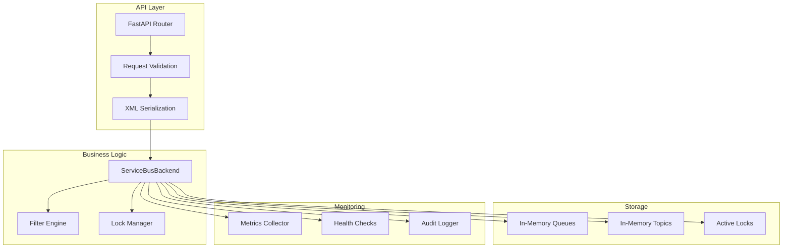
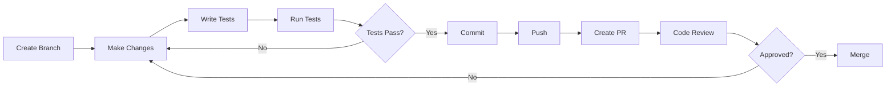
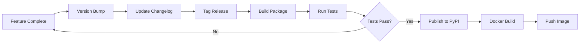

# Service Bus Contributing Guide

Developer guide for contributing to and extending LocalZure Service Bus emulator.

## Getting Started

### Development Environment

**Prerequisites:**
- Python 3.11+
- Git
- Docker (optional)
- VS Code or PyCharm (recommended)

**Clone and setup:**
```bash
git clone https://github.com/oladejiayo/localzure.git
cd localzure

# Create virtual environment
python -m venv .venv
source .venv/bin/activate  # Windows: .venv\Scripts\activate

# Install dependencies
pip install -e ".[dev]"

# Install pre-commit hooks
pre-commit install
```

### Project Structure

```
localzure/
├── localzure/
│   ├── services/
│   │   └── servicebus/
│   │       ├── api.py           # FastAPI endpoints
│   │       ├── backend.py       # Core message broker
│   │       ├── filters.py       # SQL/correlation filters
│   │       ├── models.py        # Data models
│   │       ├── metrics.py       # Prometheus metrics
│   │       ├── health_check.py  # Health endpoints
│   │       └── xml_utils.py     # XML serialization
├── tests/
│   ├── servicebus/
│   │   ├── test_messages.py
│   │   ├── test_security.py
│   │   └── test_metrics.py
├── docs/
│   └── servicebus-*.md          # Documentation
├── examples/
│   └── servicebus/              # Code examples
├── pyproject.toml               # Dependencies
└── README.md
```

## Architecture Overview



### Key Components

**1. API Layer (api.py)**
- FastAPI routes for REST endpoints
- Request/response validation
- Azure Service Bus protocol compatibility
- Atom XML serialization

**2. Backend (backend.py)**
- Core message broker logic
- Queue/topic/subscription management
- Message lifecycle (send, receive, complete, abandon)
- Lock management
- Filter evaluation orchestration

**3. Filter Engine (filters.py)**
- SQL filter parser and evaluator
- Correlation filter matcher
- Filter caching and optimization

**4. Models (models.py)**
- Pydantic data models
- Queue, Topic, Subscription, Message, Rule
- Validation and serialization

**5. Metrics (metrics.py)**
- Prometheus collectors
- Counter, Gauge, Histogram
- Background metrics collection

**6. Health Checks (health_check.py)**
- Liveness probe
- Readiness probe
- Status aggregation

## Development Workflow



### 1. Create Feature Branch

```bash
# Update main
git checkout main
git pull origin main

# Create feature branch
git checkout -b feature/add-duplicate-detection
```

### 2. Make Changes

Follow coding standards:
- PEP 8 style guide
- Type hints for all functions
- Docstrings for public APIs
- Keep functions focused and testable

**Example:**
```python
async def send_message(
    self,
    queue_name: str,
    message: Message
) -> None:
    """
    Send a message to a queue.
    
    Args:
        queue_name: Name of the target queue
        message: Message to send
        
    Raises:
        QueueNotFoundError: If queue doesn't exist
        QuotaExceededError: If queue is full
    """
    async with self._lock:
        if queue_name not in self._queues:
            raise QueueNotFoundError(queue_name)
            
        queue = self._queues[queue_name]
        if len(self._queue_messages[queue_name]) >= queue.max_size:
            raise QuotaExceededError("Queue is full")
            
        self._queue_messages[queue_name].append(message)
```

### 3. Write Tests

**Unit tests:**
```python
# tests/servicebus/test_messages.py
import pytest
from localzure.services.servicebus.backend import ServiceBusBackend
from localzure.services.servicebus.models import Message, Queue

@pytest.fixture
async def backend():
    backend = ServiceBusBackend()
    await backend.create_queue("test-queue", Queue(name="test-queue"))
    return backend

@pytest.mark.asyncio
async def test_send_message(backend):
    """Test sending a message to a queue."""
    message = Message(
        message_id="msg-001",
        body="test message"
    )
    
    await backend.send_message("test-queue", message)
    
    messages = await backend.receive_messages("test-queue", max_count=1)
    assert len(messages) == 1
    assert messages[0].body == "test message"

@pytest.mark.asyncio
async def test_send_to_nonexistent_queue(backend):
    """Test error handling for nonexistent queue."""
    message = Message(message_id="msg-001", body="test")
    
    with pytest.raises(QueueNotFoundError):
        await backend.send_message("nonexistent", message)
```

**Integration tests:**
```python
# tests/servicebus/test_integration.py
import pytest
from httpx import AsyncClient
from localzure.services.servicebus.api import app

@pytest.mark.asyncio
async def test_queue_workflow():
    """Test complete queue workflow via REST API."""
    async with AsyncClient(app=app, base_url="http://test") as client:
        # Create queue
        response = await client.put(
            "/servicebus/queues/orders",
            content=QUEUE_XML,
            headers={"Content-Type": "application/xml"}
        )
        assert response.status_code == 201
        
        # Send message
        response = await client.post(
            "/servicebus/queues/orders/messages",
            content=MESSAGE_XML,
            headers={"Content-Type": "application/xml"}
        )
        assert response.status_code == 201
        
        # Receive message
        response = await client.post(
            "/servicebus/queues/orders/messages/head",
            headers={"Content-Type": "application/xml"}
        )
        assert response.status_code == 200
        assert b"<BrokerProperties>" in response.content
```

### 4. Run Tests

```bash
# Run all tests
pytest

# Run specific test file
pytest tests/servicebus/test_messages.py

# Run with coverage
pytest --cov=localzure.services.servicebus --cov-report=html

# Run specific test
pytest tests/servicebus/test_messages.py::test_send_message -v
```

### 5. Code Quality Checks

```bash
# Format code
black localzure/services/servicebus/

# Sort imports
isort localzure/services/servicebus/

# Type checking
mypy localzure/services/servicebus/

# Linting
pylint localzure/services/servicebus/
ruff check localzure/services/servicebus/

# Run all checks
pre-commit run --all-files
```

### 6. Commit Changes

```bash
# Stage changes
git add .

# Commit with descriptive message
git commit -m "feat(servicebus): add duplicate detection

- Implement message deduplication using bloom filter
- Add RequiresDuplicateDetection queue property
- Store message hashes with 10-minute window
- Add tests for duplicate scenarios
- Update documentation

Closes #123"
```

**Commit message format:**
```
<type>(<scope>): <subject>

<body>

<footer>
```

**Types:**
- `feat`: New feature
- `fix`: Bug fix
- `docs`: Documentation only
- `test`: Adding tests
- `refactor`: Code refactoring
- `perf`: Performance improvement
- `chore`: Maintenance tasks

### 7. Create Pull Request

```bash
# Push branch
git push origin feature/add-duplicate-detection

# Create PR on GitHub
# Include:
# - Clear description
# - Related issue number
# - Test results
# - Screenshots (if UI changes)
```

**PR Template:**
```markdown
## Description
Implements duplicate detection for queues and topics using bloom filter.

## Related Issue
Closes #123

## Changes
- Added `RequiresDuplicateDetection` queue property
- Implemented bloom filter for message hash storage
- Added 10-minute deduplication window
- Updated queue creation API to support new property

## Testing
- [x] Unit tests added/updated
- [x] Integration tests pass
- [x] Manual testing completed
- [x] Documentation updated

## Performance Impact
- Memory: +10 MB per queue (bloom filter)
- Latency: +0.1ms per send (hash computation)
- Throughput: No significant impact

## Checklist
- [x] Code follows style guidelines
- [x] Tests pass locally
- [x] Documentation updated
- [x] No breaking changes
```

## Adding New Features

### Example: Add Scheduled Send Delay

**1. Update models:**
```python
# models.py
from datetime import datetime, timedelta

class Message(BaseModel):
    # ... existing fields ...
    scheduled_enqueue_time_utc: Optional[datetime] = None
```

**2. Update backend:**
```python
# backend.py
async def send_message(
    self,
    queue_name: str,
    message: Message,
    scheduled_delay: Optional[timedelta] = None
) -> None:
    """Send a message, optionally scheduled for future delivery."""
    async with self._lock:
        if scheduled_delay:
            message.scheduled_enqueue_time_utc = (
                datetime.utcnow() + scheduled_delay
            )
            self._scheduled_messages.append(message)
        else:
            self._queue_messages[queue_name].append(message)

async def _process_scheduled_messages(self) -> None:
    """Background task to deliver scheduled messages."""
    while True:
        await asyncio.sleep(5)
        async with self._lock:
            now = datetime.utcnow()
            ready = [m for m in self._scheduled_messages 
                     if m.scheduled_enqueue_time_utc <= now]
            for message in ready:
                queue = self._queues[message.queue_name]
                self._queue_messages[queue.name].append(message)
                self._scheduled_messages.remove(message)
```

**3. Update API:**
```python
# api.py
@app.post("/servicebus/queues/{queue_name}/messages")
async def send_message(
    queue_name: str,
    request: Request,
    scheduled_enqueue_time: Optional[str] = Header(None)
):
    """Send a message to a queue."""
    message = parse_message(await request.body())
    
    delay = None
    if scheduled_enqueue_time:
        scheduled_time = datetime.fromisoformat(scheduled_enqueue_time)
        delay = scheduled_time - datetime.utcnow()
    
    await backend.send_message(queue_name, message, delay)
    return Response(status_code=201)
```

**4. Write tests:**
```python
# test_scheduled_messages.py
@pytest.mark.asyncio
async def test_scheduled_message(backend):
    """Test scheduled message delivery."""
    message = Message(
        message_id="msg-001",
        body="scheduled",
        scheduled_enqueue_time_utc=datetime.utcnow() + timedelta(seconds=10)
    )
    
    await backend.send_message("test-queue", message)
    
    # Should not be available immediately
    messages = await backend.receive_messages("test-queue", max_count=1)
    assert len(messages) == 0
    
    # Wait for scheduled time
    await asyncio.sleep(11)
    
    # Now should be available
    messages = await backend.receive_messages("test-queue", max_count=1)
    assert len(messages) == 1
    assert messages[0].body == "scheduled"
```

**5. Update documentation:**
```markdown
# docs/servicebus-README.md

## Scheduled Messages

Send messages for future delivery:

\`\`\`python
from datetime import datetime, timedelta

scheduled_time = datetime.utcnow() + timedelta(minutes=5)
message = ServiceBusMessage(
    "delayed message",
    scheduled_enqueue_time_utc=scheduled_time
)
await sender.send_messages(message)
\`\`\`
```

## Testing Guidelines

### Test Structure

```python
# Arrange
backend = ServiceBusBackend()
await backend.create_queue("test", Queue(name="test"))
message = Message(message_id="msg-001", body="test")

# Act
await backend.send_message("test", message)

# Assert
messages = await backend.receive_messages("test", max_count=1)
assert len(messages) == 1
assert messages[0].body == "test"
```

### Test Coverage Requirements

- **Minimum coverage:** 80%
- **Critical paths:** 100%
- **Edge cases:** Required
- **Error handling:** Required

```bash
# Check coverage
pytest --cov=localzure.services.servicebus --cov-report=term-missing

# Generate HTML report
pytest --cov=localzure.services.servicebus --cov-report=html
open htmlcov/index.html
```

### Test Categories

**1. Unit Tests**
- Test individual functions
- Mock external dependencies
- Fast execution (< 1s)

**2. Integration Tests**
- Test component interaction
- Use real dependencies
- Moderate execution (< 10s)

**3. End-to-End Tests**
- Test complete workflows
- Via REST API
- Slower execution (< 60s)

**4. Performance Tests**
- Measure latency and throughput
- Benchmark against targets
- Detect regressions

## Code Style Guide

### Python Style

```python
# Good: Type hints, docstring, error handling
async def receive_messages(
    self,
    queue_name: str,
    max_count: int = 1,
    timeout: Optional[int] = None
) -> List[Message]:
    """
    Receive messages from a queue using peek-lock.
    
    Args:
        queue_name: Name of the queue
        max_count: Maximum number of messages to receive
        timeout: Receive timeout in seconds (optional)
        
    Returns:
        List of received messages
        
    Raises:
        QueueNotFoundError: If queue doesn't exist
    """
    if queue_name not in self._queues:
        raise QueueNotFoundError(queue_name)
    
    # Implementation...

# Bad: No types, no docstring, unclear naming
async def rcv(q, n=1, t=None):
    if q not in self._q:
        raise Exception("not found")
    # Implementation...
```

### Naming Conventions

- **Classes:** `PascalCase` (e.g., `ServiceBusBackend`)
- **Functions:** `snake_case` (e.g., `send_message`)
- **Constants:** `UPPER_SNAKE_CASE` (e.g., `MAX_QUEUE_SIZE`)
- **Private:** `_leading_underscore` (e.g., `_lock`)

### Import Order

```python
# Standard library
import asyncio
from datetime import datetime
from typing import List, Optional

# Third-party
from fastapi import FastAPI, Request
from pydantic import BaseModel
import pytest

# Local
from localzure.services.servicebus.backend import ServiceBusBackend
from localzure.services.servicebus.models import Message, Queue
```

## Documentation Standards

### Code Documentation

```python
def evaluate_sql_filter(expression: str, properties: dict) -> bool:
    """
    Evaluate SQL filter expression against message properties.
    
    Supports:
    - Comparison: =, !=, <, >, <=, >=
    - Logical: AND, OR, NOT
    - Set: IN, NOT IN
    - Pattern: LIKE, NOT LIKE
    - Null: IS NULL, IS NOT NULL
    
    Args:
        expression: SQL filter expression (e.g., "priority = 'high'")
        properties: Message properties to evaluate against
        
    Returns:
        True if expression matches, False otherwise
        
    Raises:
        InvalidFilterExpressionError: If expression is malformed
        
    Example:
        >>> evaluate_sql_filter("priority = 'high'", {"priority": "high"})
        True
        >>> evaluate_sql_filter("quantity > 100", {"quantity": 150})
        True
    """
```

### User Documentation

- **Clear structure:** Use headings, bullets, tables
- **Code examples:** Complete, runnable code
- **Troubleshooting:** Common issues and solutions
- **Links:** Cross-reference related docs

## Performance Considerations

### Profiling

```python
import cProfile
import pstats

# Profile send operations
profiler = cProfile.Profile()
profiler.enable()

for i in range(1000):
    await backend.send_message("test", Message(body=f"msg-{i}"))

profiler.disable()
stats = pstats.Stats(profiler)
stats.sort_stats('cumulative')
stats.print_stats(20)
```

### Async Best Practices

```python
# Good: Concurrent operations
tasks = [backend.send_message("test", msg) for msg in messages]
await asyncio.gather(*tasks)

# Bad: Sequential operations
for msg in messages:
    await backend.send_message("test", msg)
```

### Memory Management

```python
# Good: Limit queue size
if len(self._queue_messages[queue_name]) >= MAX_QUEUE_SIZE:
    raise QuotaExceededError()

# Bad: Unbounded growth
self._queue_messages[queue_name].append(message)
```

## Release Process



### Version Numbering

Follow Semantic Versioning (SemVer):
- **Major:** Breaking changes (e.g., 1.0.0 → 2.0.0)
- **Minor:** New features (e.g., 1.0.0 → 1.1.0)
- **Patch:** Bug fixes (e.g., 1.0.0 → 1.0.1)

## Getting Help

### Resources

- **Documentation:** [docs/](../docs/)
- **Examples:** [examples/servicebus/](../examples/servicebus/)
- **Issue Tracker:** GitHub Issues
- **Discussions:** GitHub Discussions

### Communication Channels

- **Bug reports:** GitHub Issues
- **Feature requests:** GitHub Discussions
- **Questions:** Stack Overflow (tag: `localzure`)
- **Security issues:** security@localzure.dev

## Related Documentation

- [README](servicebus-README.md)
- [Architecture](servicebus-architecture.md)
- [Troubleshooting](servicebus-troubleshooting.md)
- [Operations Runbook](servicebus-operations.md)
