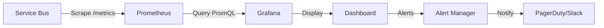
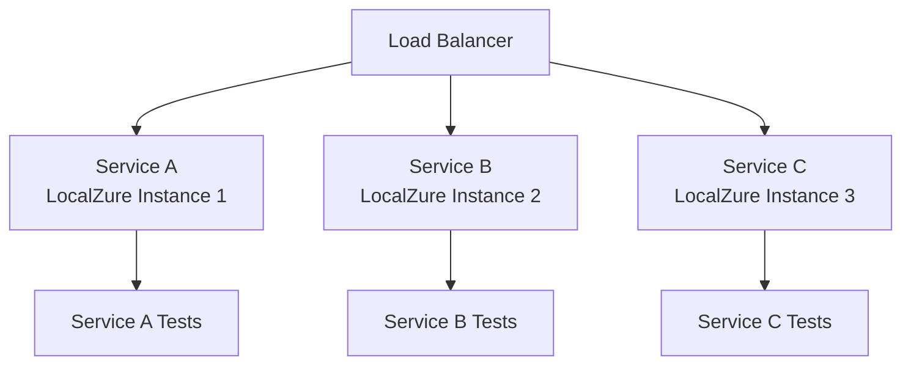

# Service Bus Operations Runbook

Production-ready deployment and operations guide for LocalZure Service Bus.

## Deployment Options

### 1. Docker Deployment

#### Single Container

```bash
# Pull image
docker pull localzure/servicebus:latest

# Run container
docker run -d \
  --name localzure-servicebus \
  -p 8000:8000 \
  -e LOG_LEVEL=INFO \
  -e MAX_QUEUE_SIZE=10000 \
  localzure/servicebus:latest
```

#### Docker Compose

```yaml
# docker-compose.yml
version: '3.8'

services:
  servicebus:
    image: localzure/servicebus:latest
    container_name: localzure-servicebus
    ports:
      - "8000:8000"
    environment:
      - LOG_LEVEL=INFO
      - MAX_QUEUE_SIZE=10000
      - LOCK_DURATION_SECONDS=60
      - RATE_LIMIT_MSG_PER_SEC=1000
    volumes:
      - ./config.yaml:/app/config.yaml:ro
      - ./logs:/app/logs
    healthcheck:
      test: ["CMD", "curl", "-f", "http://localhost:8000/servicebus/health"]
      interval: 30s
      timeout: 10s
      retries: 3
      start_period: 10s
    restart: unless-stopped
    
  prometheus:
    image: prom/prometheus:latest
    ports:
      - "9090:9090"
    volumes:
      - ./prometheus.yml:/etc/prometheus/prometheus.yml:ro
    command:
      - '--config.file=/etc/prometheus/prometheus.yml'
    depends_on:
      - servicebus
      
  grafana:
    image: grafana/grafana:latest
    ports:
      - "3000:3000"
    environment:
      - GF_SECURITY_ADMIN_PASSWORD=admin
    volumes:
      - ./grafana-dashboard.json:/etc/grafana/provisioning/dashboards/servicebus.json:ro
    depends_on:
      - prometheus
```

**Start services:**
```bash
docker-compose up -d
```

### 2. Kubernetes Deployment

#### Deployment Manifest

```yaml
# servicebus-deployment.yaml
apiVersion: apps/v1
kind: Deployment
metadata:
  name: localzure-servicebus
  namespace: localzure
spec:
  replicas: 1
  selector:
    matchLabels:
      app: servicebus
  template:
    metadata:
      labels:
        app: servicebus
    spec:
      containers:
      - name: servicebus
        image: localzure/servicebus:latest
        ports:
        - containerPort: 8000
          name: http
        env:
        - name: LOG_LEVEL
          value: "INFO"
        - name: MAX_QUEUE_SIZE
          value: "10000"
        resources:
          requests:
            memory: "256Mi"
            cpu: "500m"
          limits:
            memory: "1Gi"
            cpu: "2000m"
        livenessProbe:
          httpGet:
            path: /servicebus/health/live
            port: 8000
          initialDelaySeconds: 10
          periodSeconds: 30
          timeoutSeconds: 5
        readinessProbe:
          httpGet:
            path: /servicebus/health/ready
            port: 8000
          initialDelaySeconds: 5
          periodSeconds: 10
          timeoutSeconds: 5
---
apiVersion: v1
kind: Service
metadata:
  name: servicebus
  namespace: localzure
spec:
  selector:
    app: servicebus
  ports:
  - port: 8000
    targetPort: 8000
    protocol: TCP
  type: ClusterIP
---
apiVersion: v1
kind: ConfigMap
metadata:
  name: servicebus-config
  namespace: localzure
data:
  config.yaml: |
    servicebus:
      performance:
        max_queue_size: 10000
        lock_duration_seconds: 60
```

**Deploy:**
```bash
kubectl create namespace localzure
kubectl apply -f servicebus-deployment.yaml
```

#### Service Monitoring

```yaml
# servicemonitor.yaml
apiVersion: monitoring.coreos.com/v1
kind: ServiceMonitor
metadata:
  name: servicebus-metrics
  namespace: localzure
spec:
  selector:
    matchLabels:
      app: servicebus
  endpoints:
  - port: http
    path: /servicebus/metrics
    interval: 30s
```

### 3. Systemd Service (Linux)

```ini
# /etc/systemd/system/localzure-servicebus.service
[Unit]
Description=LocalZure Service Bus Emulator
After=network.target

[Service]
Type=simple
User=localzure
WorkingDirectory=/opt/localzure
Environment="LOG_LEVEL=INFO"
Environment="MAX_QUEUE_SIZE=10000"
ExecStart=/usr/local/bin/localzure start --service servicebus
Restart=on-failure
RestartSec=5s

[Install]
WantedBy=multi-user.target
```

**Manage service:**
```bash
sudo systemctl enable localzure-servicebus
sudo systemctl start localzure-servicebus
sudo systemctl status localzure-servicebus
```

### 4. Windows Service

```powershell
# Install as Windows service using NSSM
nssm install LocalZureServiceBus "C:\Program Files\LocalZure\localzure.exe"
nssm set LocalZureServiceBus AppParameters "start --service servicebus"
nssm set LocalZureServiceBus AppDirectory "C:\Program Files\LocalZure"
nssm set LocalZureServiceBus DisplayName "LocalZure Service Bus"
nssm set LocalZureServiceBus Description "Azure Service Bus Emulator"
nssm set LocalZureServiceBus Start SERVICE_AUTO_START
nssm start LocalZureServiceBus
```

## Configuration Management

### Environment Variables

```bash
# Core Settings
export SERVICEBUS_HOST=0.0.0.0
export SERVICEBUS_PORT=8000
export LOG_LEVEL=INFO
export LOG_FILE=/var/log/localzure/servicebus.log

# Performance
export MAX_QUEUE_SIZE=10000
export MAX_MESSAGE_SIZE_KB=256
export MAX_ENTITY_COUNT=1000
export LOCK_DURATION_SECONDS=60
export DEFAULT_MESSAGE_TTL_SECONDS=1209600
export MAX_DELIVERY_COUNT=10

# Background Tasks
export BACKGROUND_TASK_INTERVAL=10
export SCHEDULED_MESSAGE_CHECK_INTERVAL=5
export METRICS_COLLECTION_INTERVAL=60

# Rate Limiting
export RATE_LIMIT_MSG_PER_SEC=1000
export RATE_LIMIT_ENABLED=true

# Security (Stub)
export ENABLE_AUTH_VALIDATION=false
export ENABLE_TLS=false

# Monitoring
export ENABLE_METRICS=true
export ENABLE_HEALTH_CHECKS=true
export ENABLE_AUDIT_LOGGING=true
```

### YAML Configuration File

```yaml
# config.yaml
servicebus:
  server:
    host: 0.0.0.0
    port: 8000
    workers: 4
    
  logging:
    level: INFO
    file: /var/log/localzure/servicebus.log
    format: json
    correlation_id: true
    
  performance:
    max_queue_size: 10000
    max_message_size_kb: 256
    max_entity_count: 1000
    lock_duration_seconds: 60
    default_message_ttl_seconds: 1209600
    max_delivery_count: 10
    
  background_tasks:
    interval: 10
    scheduled_message_check: 5
    metrics_collection: 60
    
  rate_limiting:
    enabled: true
    messages_per_second: 1000
    burst_size: 2000
    
  security:
    enable_auth_validation: false
    enable_tls: false
    
  monitoring:
    enable_metrics: true
    enable_health_checks: true
    enable_audit_logging: true
    
  limits:
    max_concurrent_locks: 10000
    max_subscriptions_per_topic: 2000
    filter_cache_size: 100
```

**Load configuration:**
```bash
localzure start --config config.yaml
```

## Health Checks

### Endpoints

```bash
# Overall health status
curl http://localhost:8000/servicebus/health
# Response: {"status": "healthy", "queues": 5, "topics": 3}

# Liveness probe (is process alive?)
curl http://localhost:8000/servicebus/health/live
# Response: 200 OK

# Readiness probe (can handle requests?)
curl http://localhost:8000/servicebus/health/ready
# Response: 200 OK (or 503 Service Unavailable)
```

### Health Check Responses

```json
// Healthy
{
  "status": "healthy",
  "queues": 5,
  "topics": 3,
  "subscriptions": 10,
  "active_messages": 42,
  "active_locks": 8,
  "uptime_seconds": 3600
}

// Degraded
{
  "status": "degraded",
  "queues": 5,
  "topics": 3,
  "warnings": [
    "High memory usage: 85%",
    "Queue 'orders' has 9500 messages (near limit)"
  ]
}

// Unhealthy
{
  "status": "unhealthy",
  "error": "Backend initialization failed",
  "queues": 0,
  "topics": 0
}
```

### Integration with Load Balancers

**Kubernetes:**
```yaml
livenessProbe:
  httpGet:
    path: /servicebus/health/live
    port: 8000
  initialDelaySeconds: 10
  periodSeconds: 30

readinessProbe:
  httpGet:
    path: /servicebus/health/ready
    port: 8000
  initialDelaySeconds: 5
  periodSeconds: 10
```

**AWS ELB:**
```json
{
  "HealthCheck": {
    "Target": "HTTP:8000/servicebus/health",
    "Interval": 30,
    "Timeout": 5,
    "UnhealthyThreshold": 2,
    "HealthyThreshold": 2
  }
}
```

## Monitoring

### Prometheus Integration

**Prometheus configuration:**
```yaml
# prometheus.yml
scrape_configs:
  - job_name: 'servicebus'
    static_configs:
      - targets: ['localhost:8000']
    metrics_path: '/servicebus/metrics'
    scrape_interval: 30s
```

**Key metrics:**
```promql
# Message throughput (msg/s)
rate(servicebus_messages_sent_total[1m])
rate(servicebus_messages_received_total[1m])

# Latency (P50, P95, P99)
histogram_quantile(0.50, rate(servicebus_send_duration_seconds_bucket[5m]))
histogram_quantile(0.95, rate(servicebus_send_duration_seconds_bucket[5m]))
histogram_quantile(0.99, rate(servicebus_send_duration_seconds_bucket[5m]))

# Queue depth
servicebus_active_messages

# Error rate
rate(servicebus_errors_total[5m])

# Dead-letter messages
servicebus_deadletter_messages

# Active locks
servicebus_active_locks
```

### Grafana Dashboard



**Import dashboard:**
```bash
# Copy dashboard JSON
cp grafana-dashboard.json /etc/grafana/provisioning/dashboards/

# Restart Grafana
systemctl restart grafana-server
```

**Dashboard panels:**
1. Message Rate (msg/s)
2. Latency (P50, P95, P99)
3. Queue Depths
4. Error Rate
5. Dead-Letter Queue
6. Active Locks
7. Memory Usage
8. CPU Usage

### Alerting Rules

```yaml
# prometheus-alerts.yml
groups:
  - name: servicebus
    rules:
      # High error rate
      - alert: HighErrorRate
        expr: rate(servicebus_errors_total[5m]) > 0.05
        for: 5m
        labels:
          severity: critical
        annotations:
          summary: "Service Bus error rate > 5%"
          description: "Error rate is {{ $value | humanizePercentage }}"
          
      # High latency
      - alert: HighLatency
        expr: histogram_quantile(0.95, rate(servicebus_send_duration_seconds_bucket[5m])) > 1.0
        for: 5m
        labels:
          severity: warning
        annotations:
          summary: "P95 latency > 1 second"
          description: "P95 latency is {{ $value }}s"
          
      # Queue backlog
      - alert: QueueBacklog
        expr: servicebus_active_messages > 5000
        for: 10m
        labels:
          severity: warning
        annotations:
          summary: "Queue has {{ $value }} messages"
          description: "Queue depth exceeds threshold"
          
      # Dead-letter threshold
      - alert: DeadLetterThreshold
        expr: servicebus_deadletter_messages > 10
        for: 5m
        labels:
          severity: warning
        annotations:
          summary: "Dead-letter queue has {{ $value }} messages"
          description: "Investigate message failures"
          
      # Service unhealthy
      - alert: ServiceUnhealthy
        expr: up{job="servicebus"} == 0
        for: 1m
        labels:
          severity: critical
        annotations:
          summary: "Service Bus is down"
          description: "Service unreachable for 1 minute"
```

## Log Management

### Log Configuration

```yaml
# Structured JSON logging
logging:
  level: INFO
  format: json
  file: /var/log/localzure/servicebus.log
  rotation:
    max_size_mb: 100
    max_files: 10
```

### Log Format

```json
{
  "timestamp": "2025-12-08T10:30:45.123Z",
  "level": "INFO",
  "correlation_id": "abc-123-def-456",
  "operation": "send_message",
  "entity_type": "queue",
  "entity_name": "orders",
  "message_id": "msg-001",
  "duration_ms": 2.5,
  "status": "success"
}
```

### Log Collection

**Fluentd configuration:**
```conf
<source>
  @type tail
  path /var/log/localzure/servicebus.log
  pos_file /var/log/td-agent/servicebus.pos
  tag servicebus
  <parse>
    @type json
  </parse>
</source>

<match servicebus>
  @type elasticsearch
  host elasticsearch
  port 9200
  index_name servicebus
  type_name _doc
</match>
```

**Splunk configuration:**
```ini
[monitor:///var/log/localzure/servicebus.log]
disabled = false
sourcetype = json
index = localzure
```

### Log Analysis Queries

**Elasticsearch:**
```json
GET /servicebus/_search
{
  "query": {
    "bool": {
      "must": [
        {"match": {"level": "ERROR"}},
        {"range": {"timestamp": {"gte": "now-1h"}}}
      ]
    }
  },
  "aggs": {
    "error_types": {
      "terms": {"field": "error_type"}
    }
  }
}
```

**Splunk:**
```spl
index=localzure sourcetype=json level=ERROR
| stats count by error_type
| sort -count
```

## Backup and Restore

### Note on Persistence

⚠️ **LocalZure uses in-memory storage by default.** All data is lost on restart.

For persistence (planned in SVC-SB-010):
- Export entity configurations
- Snapshot message state
- Backup to external storage

### Export Entity Configurations

```bash
# Export all queues
curl http://localhost:8000/servicebus/queues > queues.json

# Export all topics
curl http://localhost:8000/servicebus/topics > topics.json

# Export subscriptions
for topic in $(curl http://localhost:8000/servicebus/topics | jq -r '.[].name'); do
  curl http://localhost:8000/servicebus/topics/$topic/subscriptions > subscriptions-$topic.json
done
```

### Restore Entities

```python
import requests
import json

BASE_URL = "http://localhost:8000/servicebus"

# Restore queues
with open('queues.json') as f:
    queues = json.load(f)
    for queue in queues:
        requests.put(f"{BASE_URL}/queues/{queue['name']}", 
                     headers={"Content-Type": "application/xml"},
                     data=queue['xml'])

# Restore topics
with open('topics.json') as f:
    topics = json.load(f)
    for topic in topics:
        requests.put(f"{BASE_URL}/topics/{topic['name']}", 
                     headers={"Content-Type": "application/xml"},
                     data=topic['xml'])
```

## Scaling Strategies

### Vertical Scaling

```yaml
# Increase resources
resources:
  requests:
    memory: "512Mi"
    cpu: "1000m"
  limits:
    memory: "2Gi"
    cpu: "4000m"

# Increase limits
environment:
  - name: MAX_QUEUE_SIZE
    value: "50000"
  - name: MAX_ENTITY_COUNT
    value: "5000"
```

### Horizontal Scaling (Limited)

⚠️ **LocalZure does not support distributed operation.** Use multiple independent instances for different services:



### Performance Tuning

See [Performance Guide](servicebus-performance.md) for:
- Configuration optimization
- Batch operations
- Filter optimization
- Resource limits

## Upgrade Procedures

### Zero-Downtime Upgrade (Not Supported)

⚠️ LocalZure is stateless. Upgrading requires restart and data loss.

### Upgrade Steps

```bash
# 1. Export configurations
./export-config.sh

# 2. Stop service
docker-compose down
# OR
systemctl stop localzure-servicebus

# 3. Backup logs
cp -r /var/log/localzure /var/log/localzure.backup

# 4. Pull new image
docker pull localzure/servicebus:latest

# 5. Update deployment
docker-compose up -d
# OR
systemctl start localzure-servicebus

# 6. Verify health
curl http://localhost:8000/servicebus/health

# 7. Restore configurations
./restore-config.sh

# 8. Run smoke tests
pytest tests/smoke/
```

### Rollback Procedure

```bash
# 1. Stop new version
docker-compose down

# 2. Start old version
docker-compose -f docker-compose.old.yml up -d

# 3. Verify health
curl http://localhost:8000/servicebus/health

# 4. Restore configurations
./restore-config.sh
```

## Troubleshooting Operations

### Service Won't Start

```bash
# Check logs
docker logs localzure-servicebus
journalctl -u localzure-servicebus -n 100

# Check port availability
netstat -an | grep 8000
lsof -i :8000

# Check permissions
ls -la /var/log/localzure
ls -la /opt/localzure

# Check configuration
localzure validate-config config.yaml
```

### High Memory Usage

```bash
# Check memory
docker stats localzure-servicebus

# View metrics
curl http://localhost:8000/servicebus/metrics | grep process_

# Reduce limits
docker-compose down
# Edit docker-compose.yml: MAX_QUEUE_SIZE=1000
docker-compose up -d
```

### Connection Issues

```bash
# Test connectivity
curl http://localhost:8000/servicebus/health

# Check firewall
sudo ufw status
sudo iptables -L -n

# Check DNS
nslookup localhost
ping localhost
```

## Security Considerations

### Authentication (Stub)

⚠️ **LocalZure does not enforce authentication.** Any connection string works.

**For production-like testing:**
- Use Azure Service Bus (real authentication)
- Network isolation (firewall rules)
- API gateway with authentication

### Network Security

```yaml
# Restrict to localhost only
environment:
  - name: SERVICEBUS_HOST
    value: "127.0.0.1"

# Or use reverse proxy with auth
nginx:
  location /servicebus/ {
    auth_basic "Restricted";
    auth_basic_user_file /etc/nginx/.htpasswd;
    proxy_pass http://localhost:8000/servicebus/;
  }
```

### Audit Logging

```bash
# Enable audit logging
export ENABLE_AUDIT_LOGGING=true

# Audit log format
{
  "timestamp": "2025-12-08T10:30:45.123Z",
  "operation": "send_message",
  "user": "service-account",
  "entity": "queue/orders",
  "result": "success",
  "ip_address": "10.0.0.1"
}
```

## CI/CD Integration

### GitHub Actions

```yaml
# .github/workflows/test.yml
name: Integration Tests

on: [push, pull_request]

jobs:
  test:
    runs-on: ubuntu-latest
    services:
      servicebus:
        image: localzure/servicebus:latest
        ports:
          - 8000:8000
        env:
          LOG_LEVEL: DEBUG
          MAX_QUEUE_SIZE: 1000
    steps:
      - uses: actions/checkout@v3
      - name: Wait for Service Bus
        run: |
          timeout 30 bash -c 'until curl -f http://localhost:8000/servicebus/health; do sleep 1; done'
      - name: Run tests
        run: pytest tests/integration/
```

### GitLab CI

```yaml
# .gitlab-ci.yml
test:
  image: python:3.11
  services:
    - name: localzure/servicebus:latest
      alias: servicebus
  variables:
    SERVICE_BUS_CONNECTION: "Endpoint=sb://servicebus:8000/servicebus/;SharedAccessKeyName=RootManageSharedAccessKey;SharedAccessKey=fake-key"
  script:
    - pip install -r requirements.txt
    - pytest tests/integration/
```

## Related Documentation

- [README](servicebus-README.md)
- [Architecture](servicebus-architecture.md)
- [Performance Guide](servicebus-performance.md)
- [Troubleshooting](servicebus-troubleshooting.md)
- [Contributing](servicebus-contributing.md)
