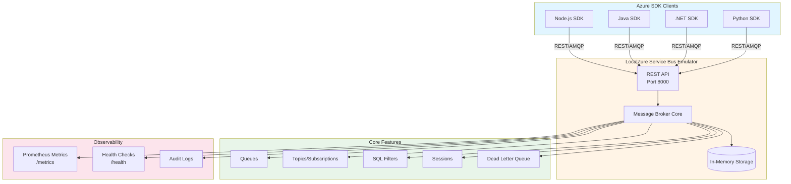

# LocalZure Service Bus Emulator

> **Azure Service Bus locally** — Full-featured emulator for development and testing

A high-fidelity emulator for Azure Service Bus that runs entirely on your local machine. Perfect for development, testing, and CI/CD pipelines without Azure costs or internet connectivity.

## 🎯 Quick Start

### Installation

```bash
# Install from source
git clone https://github.com/yourusername/localzure.git
cd localzure
pip install -e .
```

### Running the Emulator

```bash
# Start the emulator
localzure start

# Development mode with hot reload
localzure start --reload

# Custom port
localzure start --port 8080

# Docker
docker run -p 5672:5672 -p 8000:8000 localzure/servicebus:latest
```

The emulator will be available at:
- **REST API**: `http://localhost:8000/servicebus`
- **Health Checks**: `http://localhost:8000/servicebus/health`
- **Metrics**: `http://localhost:8000/servicebus/metrics`
- **API Docs**: `http://localhost:8000/docs`

### Basic Queue Example (Send/Receive)

```python
from azure.servicebus import ServiceBusClient, ServiceBusMessage

# Connect to LocalZure
connection_string = "Endpoint=http://localhost:5672;SharedAccessKeyName=RootManageSharedAccessKey;SharedAccessKey=fake"
client = ServiceBusClient.from_connection_string(connection_string)

# Create a queue (using REST API or management SDK)
import requests
requests.put(
    "http://localhost:8000/servicebus/queues/myqueue",
    headers={"Content-Type": "application/xml"},
    data='<entry xmlns="http://www.w3.org/2005/Atom"><content type="application/xml"><QueueDescription xmlns="http://schemas.microsoft.com/netservices/2010/10/servicebus/connect"><LockDuration>PT60S</LockDuration></QueueDescription></content></entry>'
)

# Send a message
with client.get_queue_sender("myqueue") as sender:
    message = ServiceBusMessage("Hello, LocalZure!")
    sender.send_messages(message)
    print("✅ Message sent")

# Receive and process
with client.get_queue_receiver("myqueue") as receiver:
    for msg in receiver:
        print(f"📨 Received: {str(msg)}")
        receiver.complete_message(msg)
        print("✅ Message completed")
        break
```

### Basic Topic Example (Publish/Subscribe)

```python
from azure.servicebus import ServiceBusClient, ServiceBusMessage

client = ServiceBusClient.from_connection_string(connection_string)

# Create topic and subscriptions (using REST API)
import requests

# Create topic
requests.put(
    "http://localhost:8000/servicebus/topics/orders",
    headers={"Content-Type": "application/xml"},
    data='<entry xmlns="http://www.w3.org/2005/Atom"><content type="application/xml"><TopicDescription xmlns="http://schemas.microsoft.com/netservices/2010/10/servicebus/connect"></TopicDescription></content></entry>'
)

# Create subscription with filter
requests.put(
    "http://localhost:8000/servicebus/topics/orders/subscriptions/high-priority",
    headers={"Content-Type": "application/xml"},
    data='<entry xmlns="http://www.w3.org/2005/Atom"><content type="application/xml"><SubscriptionDescription xmlns="http://schemas.microsoft.com/netservices/2010/10/servicebus/connect"><LockDuration>PT60S</LockDuration></SubscriptionDescription></content></entry>'
)

# Add filter rule
requests.put(
    "http://localhost:8000/servicebus/topics/orders/subscriptions/high-priority/rules/priority-filter",
    headers={"Content-Type": "application/xml"},
    data='<entry xmlns="http://www.w3.org/2005/Atom"><content type="application/xml"><RuleDescription xmlns="http://schemas.microsoft.com/netservices/2010/10/servicebus/connect"><Filter><SqlExpression>priority = \'high\'</SqlExpression></Filter></RuleDescription></content></entry>'
)

# Publish message to topic
with client.get_topic_sender("orders") as sender:
    message = ServiceBusMessage(
        "New order #12345",
        application_properties={"priority": "high", "amount": 500.00}
    )
    sender.send_messages(message)
    print("📤 Message published to topic")

# Subscribe and receive
with client.get_subscription_receiver("orders", "high-priority") as receiver:
    for msg in receiver:
        print(f"📨 Subscription received: {str(msg)}")
        print(f"   Properties: {msg.application_properties}")
        receiver.complete_message(msg)
        break
```

## ✨ Features

### Queues
- ✅ **FIFO Message Delivery** - First-in, first-out ordering
- ✅ **PeekLock & ReceiveAndDelete** - Two receive modes
- ✅ **Message Locking** - Configurable lock duration (default 60s)
- ✅ **Dead-Letter Queue** - Automatic DLQ for failed messages
- ✅ **Scheduled Messages** - Send messages to be delivered later
- ✅ **Message Deferral** - Defer message processing
- ✅ **Peek Messages** - Non-destructive message viewing
- ✅ **Sessions** - Ordered message processing with session IDs
- ✅ **Auto-Delete on Idle** - Automatic cleanup of idle queues
- ✅ **Duplicate Detection** - (Planned - SVC-SB-010)

### Topics and Subscriptions
- ✅ **Publish/Subscribe Pattern** - One-to-many message distribution
- ✅ **SQL Filters** - Advanced content-based routing
- ✅ **Correlation Filters** - Fast property-based filtering
- ✅ **Multiple Subscriptions** - Up to 2000 subscriptions per topic
- ✅ **Subscription Rules** - Multiple rules per subscription
- ✅ **Dead-Letter Queue per Subscription** - Isolated DLQs
- ✅ **Forward To** - (Planned)

### Message Features
- ✅ **Message Properties** - System and user-defined properties
- ✅ **Content Types** - Support for any content type
- ✅ **Message Size** - Up to 256 KB per message (Standard tier)
- ✅ **Time-to-Live (TTL)** - Automatic message expiration
- ✅ **Correlation ID** - Request-reply pattern support
- ✅ **Session Support** - Stateful message processing

### Monitoring and Operations
- ✅ **Prometheus Metrics** - Message throughput, latency, errors
- ✅ **Health Checks** - Kubernetes-compatible liveness/readiness probes
- ✅ **Structured Logging** - JSON logs with correlation IDs
- ✅ **API Documentation** - Interactive Swagger/OpenAPI docs
- ✅ **Grafana Dashboard** - Pre-built monitoring dashboard

### Security and Reliability
- ✅ **Input Validation** - Entity names, message size, SQL injection protection
- ✅ **Rate Limiting** - Token bucket algorithm per entity
- ✅ **Audit Logging** - Track all administrative operations
- ✅ **Error Handling** - Azure-compatible error responses

## ⚙️ Configuration

### Environment Variables

```bash
# Service Bus Configuration
SERVICEBUS_PORT=8000                    # REST API port
SERVICEBUS_HOST=0.0.0.0                # Bind address
SERVICEBUS_MAX_QUEUES=1000             # Maximum number of queues
SERVICEBUS_MAX_TOPICS=1000             # Maximum number of topics
SERVICEBUS_DEFAULT_LOCK_DURATION=60    # Lock duration in seconds
SERVICEBUS_MAX_DELIVERY_COUNT=10       # Max delivery attempts before DLQ
SERVICEBUS_BACKGROUND_TASK_INTERVAL=10 # Gauge metrics update interval

# Logging
LOG_LEVEL=INFO                          # DEBUG, INFO, WARNING, ERROR
LOG_FORMAT=json                         # json or text
ENABLE_AUDIT_LOG=true                  # Enable audit logging

# Rate Limiting
RATE_LIMIT_QUEUE_MSG_PER_SEC=100       # Queue message rate limit
RATE_LIMIT_TOPIC_MSG_PER_SEC=1000      # Topic message rate limit

# Monitoring
ENABLE_METRICS=true                     # Enable Prometheus metrics
ENABLE_HEALTH_CHECKS=true              # Enable health endpoints
```

### Configuration File

Create `localzure.yaml`:

```yaml
servicebus:
  port: 8000
  host: "0.0.0.0"
  max_queues: 1000
  max_topics: 1000
  
  # Default entity properties
  defaults:
    lock_duration: 60  # seconds
    max_delivery_count: 10
    message_ttl: 604800  # 7 days in seconds
    
  # Rate limiting
  rate_limits:
    queue_messages_per_second: 100
    topic_messages_per_second: 1000
    
  # Monitoring
  monitoring:
    enable_metrics: true
    enable_health_checks: true
    metrics_update_interval: 10  # seconds

logging:
  level: "INFO"
  format: "json"
  audit_enabled: true
```

Run with config file:

```bash
localzure start --config localzure.yaml
```

### Docker Configuration

```yaml
# docker-compose.yml
version: '3.8'

services:
  servicebus:
    image: localzure/servicebus:latest
    ports:
      - "8000:8000"
      - "5672:5672"
    environment:
      - LOG_LEVEL=DEBUG
      - SERVICEBUS_MAX_QUEUES=500
    volumes:
      - ./localzure.yaml:/app/localzure.yaml
    command: ["start", "--config", "/app/localzure.yaml"]
    healthcheck:
      test: ["CMD", "curl", "-f", "http://localhost:8000/servicebus/health/live"]
      interval: 10s
      timeout: 5s
      retries: 3
```

## 🏗️ Architecture

### High-Level Architecture



### Component Details

```
│                   LocalZure Service Bus                      │
│  ┌──────────────┐  ┌──────────────┐  ┌──────────────┐     │
│  │  REST API    │  │  Validation  │  │  Rate Limit  │     │
│  │  (FastAPI)   │  │  Layer       │  │  (Token Bkt) │     │
│  └──────┬───────┘  └──────┬───────┘  └──────┬───────┘     │
│         │                  │                  │              │
│  ┌──────▼──────────────────▼──────────────────▼───────┐    │
│  │           Service Bus Backend                       │    │
│  │  ┌──────────┐  ┌──────────┐  ┌──────────┐        │    │
│  │  │  Queues  │  │  Topics   │  │ Messages │        │    │
│  │  └──────────┘  └──────────┘  └──────────┘        │    │
│  │                                                     │    │
│  │  ┌──────────┐  ┌──────────┐  ┌──────────┐        │    │
│  │  │  Locks   │  │  Filters  │  │ Sessions │        │    │
│  │  └──────────┘  └──────────┘  └──────────┘        │    │
│  └─────────────────────────────────────────────────── │    │
│                                                             │
│  ┌──────────────┐  ┌──────────────┐  ┌──────────────┐    │
│  │   Metrics    │  │  Health      │  │  Audit Log   │    │
│  │  (Prometheus)│  │  Checks      │  │  (JSON)      │    │
│  └──────────────┘  └──────────────┘  └──────────────┘    │
└─────────────────────────────────────────────────────────────┘
                 │
                 ▼
       ┌─────────────────┐
       │  Grafana        │
       │  Dashboard      │
       └─────────────────┘
```

### Data Storage

LocalZure Service Bus uses in-memory storage for maximum performance:

- **Queues**: `Dict[str, QueueDescription]`
- **Topics**: `Dict[str, TopicDescription]`
- **Subscriptions**: `Dict[Tuple[str, str], SubscriptionDescription]`
- **Messages**: `Dict[str, List[ServiceBusMessage]]`
- **Locks**: `Dict[str, Dict[str, Tuple[Message, datetime]]]`

**Tradeoff**: In-memory storage means no persistence across restarts, but provides:
- ⚡ Ultra-low latency (< 1ms P50)
- 🚀 High throughput (10,000+ msg/s)
- 🎯 Perfect for development and testing

## 📊 Resource Limits

| Resource | Limit | Azure Comparison |
|----------|-------|------------------|
| Max Queues | 1,000 (configurable) | 10,000 (Standard) |
| Max Topics | 1,000 (configurable) | 10,000 (Standard) |
| Max Subscriptions per Topic | 2,000 | 2,000 |
| Max Message Size | 256 KB | 256 KB (Standard), 1 MB (Premium) |
| Max Queue Size | 10,000 messages (configurable) | 80 GB (Standard) |
| Lock Duration | 5s - 5min | 5s - 5min |
| Message TTL | 1s - unlimited | 1ms - unlimited |
| Max Delivery Count | 1 - 2000 | 1 - 2000 |

## 🧑‍💻 Development

### Running Tests

```bash
# All tests
pytest

# Specific test file
pytest tests/unit/test_servicebus_messages.py

# With coverage
pytest --cov=localzure --cov-report=html

# Integration tests only
pytest tests/integration/
```

### Code Structure

```
localzure/
├── services/
│   └── servicebus/
│       ├── __init__.py
│       ├── api.py              # FastAPI endpoints
│       ├── backend.py          # Core Service Bus logic
│       ├── models.py           # Pydantic models
│       ├── exceptions.py       # Custom exceptions
│       ├── filter_evaluator.py # SQL/Correlation filter engine
│       ├── validation.py       # Input validation
│       ├── rate_limiter.py     # Rate limiting
│       ├── metrics.py          # Prometheus metrics
│       ├── health_check.py     # Health endpoints
│       ├── logging_utils.py    # Structured logging
│       └── audit_logger.py     # Audit logging
├── tests/
│   ├── unit/                   # Unit tests
│   ├── integration/            # Integration tests
│   └── test_servicebus_metrics.py
└── docs/                       # Documentation
```

### Adding Features

1. **Add backend logic** in `backend.py`
2. **Add API endpoint** in `api.py`
3. **Add models** in `models.py`
4. **Add tests** in `tests/`
5. **Update docs** in `docs/`

See [CONTRIBUTING.md](CONTRIBUTING.md) for detailed guidelines.

## 📚 Documentation

- **[API Reference](http://localhost:8000/docs)** - Interactive OpenAPI docs
- **[Architecture Guide](docs/servicebus-architecture.md)** - Design decisions and data flows
- **[Filter Syntax](docs/servicebus-filters.md)** - SQL and correlation filter examples
- **[Azure Compatibility](docs/servicebus-compatibility.md)** - Feature comparison matrix
- **[Troubleshooting](docs/servicebus-troubleshooting.md)** - Common issues and solutions
- **[Performance Tuning](docs/servicebus-performance.md)** - Configuration and best practices
- **[Operational Runbook](docs/servicebus-operations.md)** - Deployment and monitoring
- **[Examples](examples/)** - Code examples in multiple languages

## 🔗 Related Links

- **Azure Service Bus Documentation**: https://docs.microsoft.com/azure/service-bus-messaging/
- **Azure SDK for Python**: https://github.com/Azure/azure-sdk-for-python
- **AMQP 1.0 Specification**: http://www.amqp.org/specification/1.0/amqp-org-download

## 📝 License

MIT License - See [LICENSE](LICENSE) file for details

## 🤝 Contributing

Contributions welcome! See [CONTRIBUTING.md](docs/CONTRIBUTING.md) for guidelines.

## 🐛 Issues

Report issues at: https://github.com/yourusername/localzure/issues

## ⭐ Support

If you find LocalZure useful, please give it a star on GitHub!
